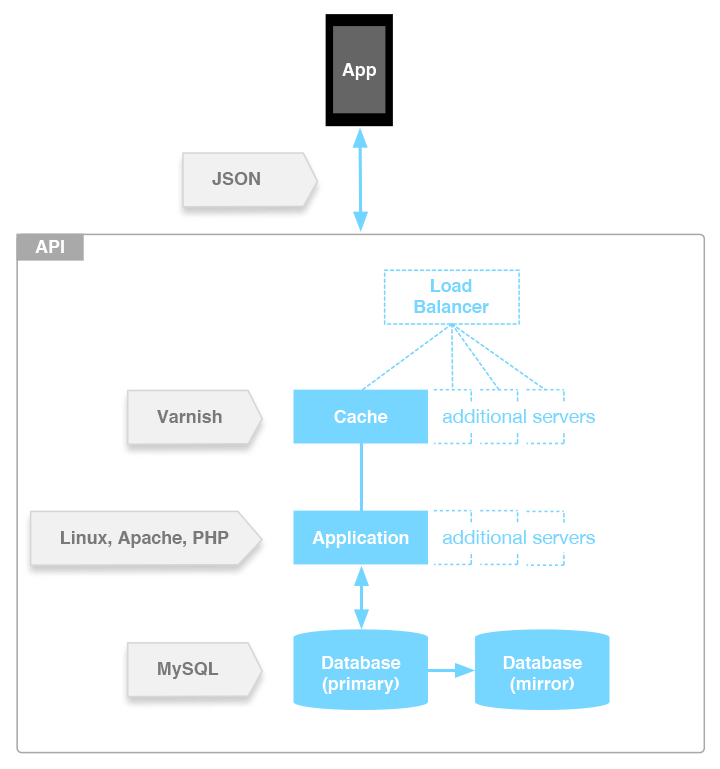
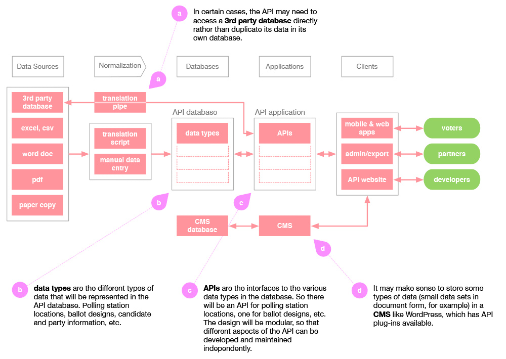

# pemilu API / elections API

This is a repository for [a website about the Pemilu API](http://pemiluapi.org/). Here is a short link for this document: [http://bit.ly/14zuJUI](http://bit.ly/14zuJUI).

## A civic information API for the 2014 Indonesian Elections

This document is the beginnings of a plan for the elections API. No code has been written yet, which means that much of how the application will be built, served and maintained has not been decided.

### What is the Pemilu API?

The Pemilu API / elections API is an open source, publicly developed civic information API for Indonesia's 2014 legislative and presidential elections. The API will serve as a functional front-end to a extensive database of election-related information such as:

- ballot designs and instructions
- electoral district maps and polling station locations
- party and candidate names and platforms
- reported voting law violations and irregularities
- election calendars and events
- aggregated news and social media feeds
- election laws and regulations
- voter education materials
- ...and much more

This data will be gathered through a network of civil society organizations, universities, research institutions and media.

The API will be built with app developers in mind – it will scale to meet traffic demands and the development team will be receptive to requests to implement new functionality or integrate new sources of data.

### Get involved with the Pemilu API

At the moment, we're looking for developers interested in working on the API and the apps that will run on it. If you're interested in being a part of this project, you can

- contact us directly at [contact@pemiluapi.org](mailto:contact@pemiluapi.org) or [@APIPemilu](https://twitter.com/APIPemilu).
- start or join a discussion on the [issues page](https://github.com/pemiluAPI/pemiluAPI.github.io/issues)
- suggest an app that could run on the API, a data source the API could provide or a piece of functionality the API should support.
- watch this repo on github

Below are some rough sketches of what the API application might look like and how it might function. Comments are welcome.

**An application diagram**

This is a rough application diagram that shows how the API might be structured, along with some suggestions for what specific technologies might be used.

**A complete process diagram**

This diagram shows in more detail how we could get from raw data source to working application to client application.

[Click for full-sized image](https://raw.github.com/pemiluAPI/pemiluAPI.github.io/master/img/process_diagram-complete-v2.gif)

**A process diagram for one module of the API: Events data**

This diagram shows the same process in more detail for one type of data – events.

[Click for full-sized image](https://raw.github.com/pemiluAPI/pemiluAPI.github.io/master/img/process_diagram-events_sequence-v2.gif)
